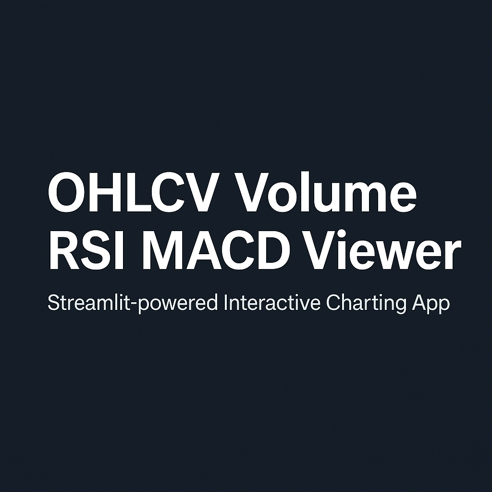

Google Sheet and Python combination for technical chart
# OHLCV + Volume + RSI + MACD Streamlit App

This app displays stock charts using data from **Google Sheets**, including:

- **Candlestick (OHLC)** chart
- **Volume** (non-negative, auto-scaled)
- **RSI (Relative Strength Index)**
- **MACD** with Signal Line and Histogram

No `yfinance` used — 

1. Data is pulled into Google Sheets using:
   ```excel
   =GOOGLEFINANCE("TCS.NS", "all", TODAY()-180, TODAY(), "DAILY")
2. The Streamlit app reads that data using gspread.

3. Plots are generated using Plotly.

### Live Demo:
[Click here to try the app](https://cv7mfz3rybxqg46fmze9o5.streamlit.app/)

   
Requirements
____________


streamlit
plotly
pandas
gspread
oauth2client

Run locally
___________

git clone https://github.com/SureshPatel9765/Ohlcv-Volume-RSI-MACD.git

cd Ohlcv-Volume-RSI-MACD

pip install -r requirements.txt

streamlit run app.py

License
_______

Free to use for personal or academic purposes.


Project Vision

This app is designed to make technical charting accessible without relying on paid APIs or complex setups.
It helps users visually interpret price and momentum indicators side-by-side, making it easier to recognize market signals.

Future Vision

The next version will allow user interaction—either by inputting a stock symbol manually or choosing from a dropdown list.
Google Apps Script may be used to dynamically update Google Sheets with historical data using GoogleFinance, keeping the app real-time and API-free.


